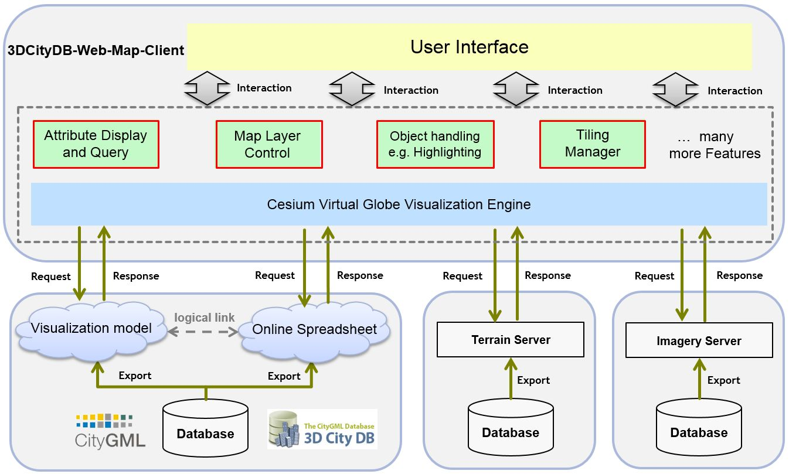
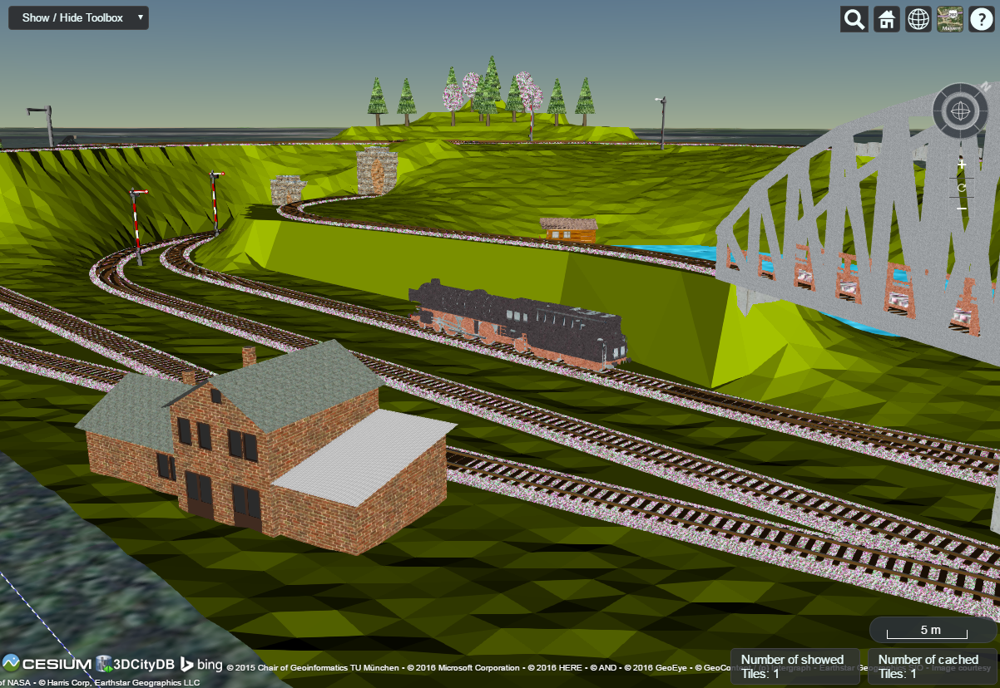
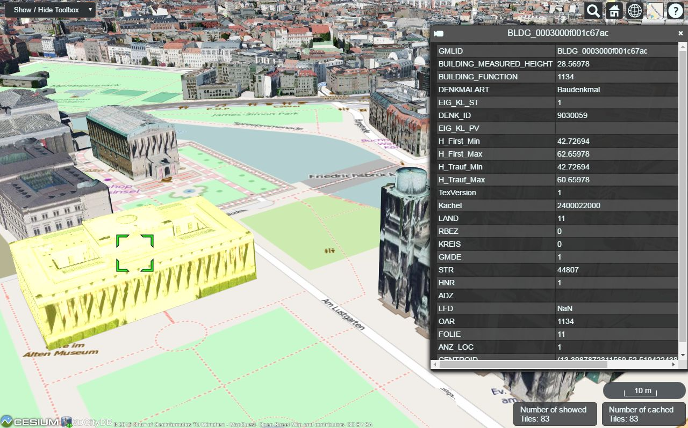
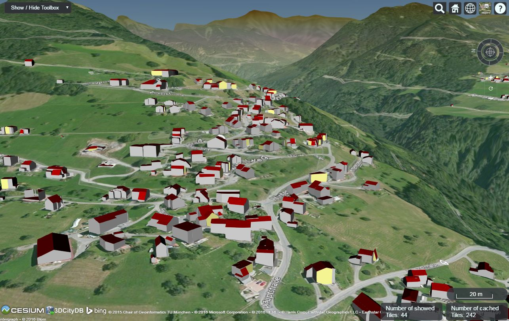
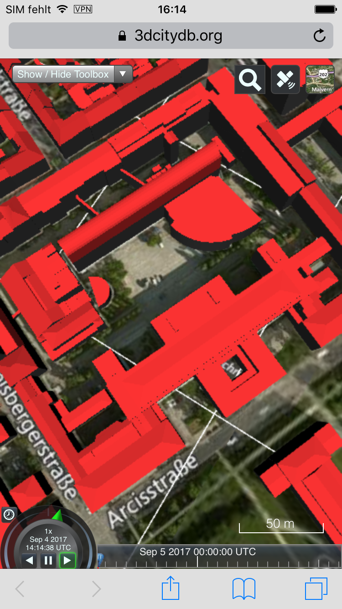
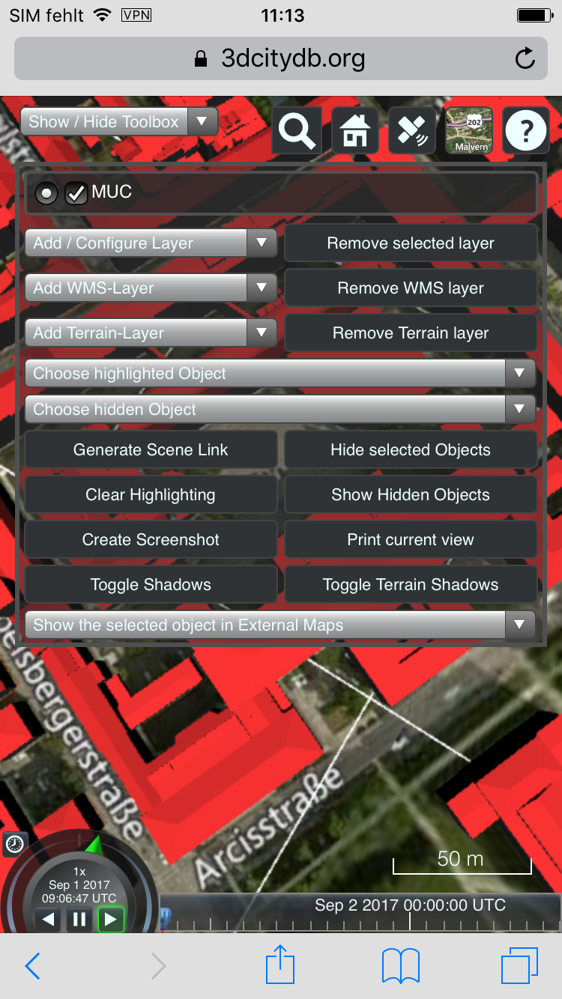
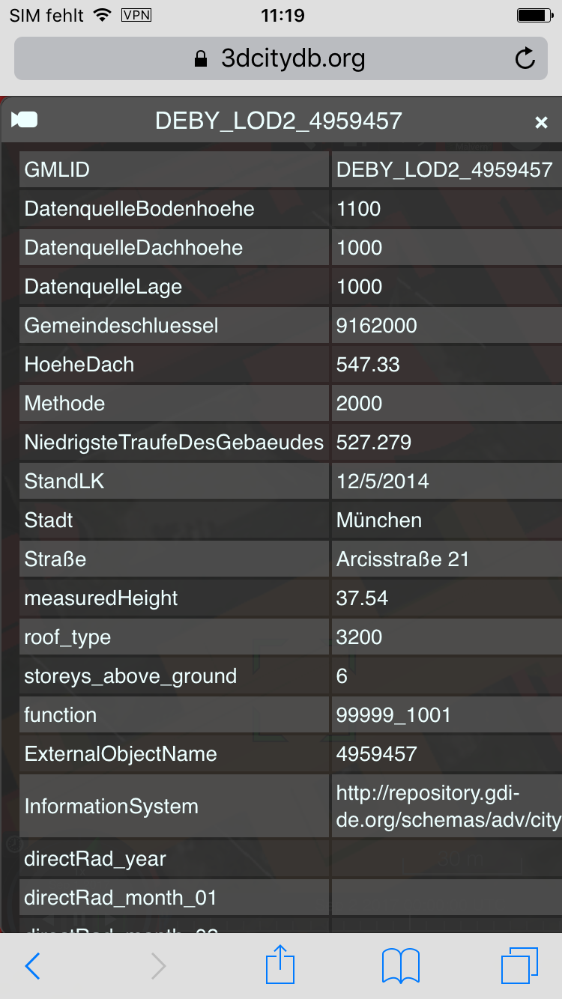
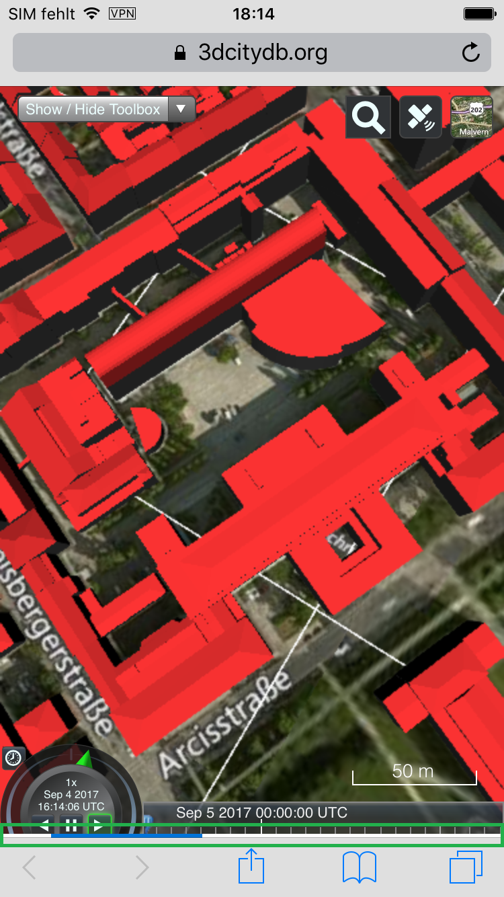

3DCityDB-Web-Map-Client
==================================

News
-------
#### [Sep 15, 2018] The current 3DCityDB Web Map Client version v1.6.1 is included in the newest major release v4.0 of the [3DCityDB](https://github.com/3dcitydb/3dcitydb).

**[Mar 28, 2018]** Docker images for the 3DCityDB are now available under [Web-Map-Client](https://github.com/tum-gis/3dcitydb-web-map-docker), [3DCityDB PostGIS](https://github.com/tum-gis/3dcitydb-docker-postgis), [Web Feature Service (WFS)](https://github.com/tum-gis/3dcitydb-wfs-docker) and [Service orchestration](https://github.com/tum-gis/3dcitydb-docker-compose).

**[Sep 5, 2017]** Mobile support has been implemented to the web client. </i></b> <a href="https://github.com/3dcitydb/3dcitydb-web-map#mobile-support-extension">Read more...</a>

Introduction
-------
The **3DCityDB-Web-Map-Client** is a web-based front-end of the 3DCityDB for high-performance 3D visualization and interactive exploration of **arbitrarily large semantic 3D city models in CityGML**. It utilizes the [Cesium Virtual Globe](http://cesiumjs.org/index.html) as its 3D geo-visualization engine based on HTML5 and Web Graphics Library (WebGL) to provide hardware acceleration and cross-platform functionalities like displaying 3D graphic contents on web browsers without the needs of additional plugins.

The key features and functionalities of the 3DCityDB-Web-Map-Client is summarized as follows: 

* Support for efficient displaying, caching, prefetching, dynamic loading and unloading of large pre-styled 3D visualization models in the form of tiled KML/glTF datasets exported from the 3DCityDB using the Importer/Exporter
* Intuitive user interface for adding and removing arbitrary number of data layers like 3D visualization model (KML/glTF), WMS imagery layer, and Cesium digital terrain model
* Support for linking the 3D visualization models (KML/glTF) with the cloud-based Google Fusion Table allowing for querying the thematic data of every 3D object
* Support for rich interaction with 3D visualization models (KML/glTF), for example, highlighting of 3D objects on mouseover and mouseclick as well as hiding and showing of the selected 3D objects
* Support for exploring a 3D object of interest from different view perspectives using third-party mapping services like Microsoft Bing Maps with oblique view, Google Streetview, and a combined version (DualMaps) 
* Support for on-the-fly activating and deactivating shadow visualization of 3D objects (only for glTF, KML is currently not supported yet) and Cesium digital terrain models
* Support for collaborative creation and sharing of the workspace of the 3DCityDB-Web-Map-Client by means of generating a scene link including information about the current camera perspective, activation status of the shadow visualization, parameters of the current loaded data layers etc.  

Architecture
-------

License
-------
The 3DCityDb-Web-Map-Client is licensed under the [Apache License, Version 2.0](http://www.apache.org/licenses/LICENSE-2.0). See the `LICENSE` file for more details.

Latest release
--------------
The latest stable release of the 3DCityDB-Web-Map-Client is `1.7.1`.

All releases are available from the [releases section](https://github.com/3dcitydb/3dcitydb-web-map/releases).

For convenient use, there is an official [web link](https://www.3dcitydb.org/3dcitydb-web-map/1.7.1/3dwebclient/index.html) available that can be called to directly run the 3DCityDb-Web-Map-Client on your web browser. 

System requirements
------------------- 
The hardware on which the 3DCityDB-Web-Map-Client will be run must have a graphics card installed that supports WebGL. In addition, the web browser in use must also provide appropriate WebGL support. 

You can visit the following website to check whether your web browser supports WebGL or not:

[http://get.webgl.org/](http://get.webgl.org/)

The 3DCityDB-Web-Map-Client has been successfully tested on (but is not limited to) the following web browsers under different desktop operating systems like Microsoft Windows, Linux, Apple Mac OS X, and even on mobile operating systems like Android and iOS. 
* Apple Safari 
* Mozilla Firefox
* Google Chrome
* Opera 

For best performance, it is recommended to use Google Chrome.

Documentation
-------------
A complete and comprehensive documentation on the 3DCityDB-Web-Map-Client is installed with the 3DCityDB Importer/Exporter and is also available [online](http://www.3dcitydb.org/3dcitydb/documentation/).

Contributing
------------
* To file bugs found in the software create a GitHub issue.
* To contribute code for fixing filed issues create a pull request with the issue id.
* To propose a new feature create a GitHub issue and open a discussion.

Developers
-----------------------------------

The 3DCityDB-Web-Map-Client has been developed by: 

* Zhihang Yao, Son H. Nguyen, Kanishk Chaturvedi, and Thomas H. Kolbe
 [Chair of Geoinformatics, Technical University of Munich](https://www.gis.bgu.tum.de/)

and with the support from the following cooperation partners:

* Jannes Bolling, Lucas van Walstijn, and Claus Nagel 
 [virtualcitySYSTEMS GmbH, Berlin](http://www.virtualcitysystems.de/)

Demos
-----------------------------------
[Demo 1: Visualization of different LoD3 CityGML top-level features (TINRelief, Building, Bridge, Tunnel, WaterBody, Vegetation, CityFurniture, Transportation etc.) in glTF format](https://www.3dcitydb.org/3dcitydb-web-map/1.7/3dwebclient/index.html?&title=Railway_Scene_LoD3_Demo&latitude=52.327365948439194&longitude=13.030088863339655&height=217.81657370772476&heading=25.2070122667291&pitch=-29.11682262163081&roll=0.09098022034414832&layer_0=url%3Dhttps%253A%252F%252Fwww.3dcitydb.net%252F3dcitydb%252Ffileadmin%252Fmydata%252FRailway_Scene_LoD3%252FRailway_Scene_LoD3_collada_MasterJSON.json%26name%3DRailway_Scene_LoD3%26active%3Dtrue%26spreadsheetUrl%3D%26minLodPixels%3D140%26maxLodPixels%3D1.7976931348623157e%252B308%26maxSizeOfCachedTiles%3D50%26maxCountOfVisibleTiles%3D200)

[Demo 2: Visualization of semantic 3D City Model of Berlin. This Demo shows all Berlin buildings (> 500,000) with textured 3D geometries (LoD2) and thematic attributes per building](https://www.3dcitydb.org/3dcitydb-web-map/1.7/3dwebclient/index.html?title=Berlin_Demo&batchSize=1&latitude=52.517479728958044&longitude=13.411141287558161&height=534.3099172951087&heading=345.2992773976952&pitch=-44.26228062802528&roll=359.933888621294&layer_0=url%3Dhttps%253A%252F%252Fwww.3dcitydb.net%252F3dcitydb%252Ffileadmin%252Fmydata%252FBerlin_Demo%252FBerlin_Buildings_rgbTexture_ScaleFactor_0.3%252FBerlin_Buildings_rgbTexture_collada_MasterJSON.json%26name%3DBrlin_Buildings_rgbTexture%26active%3Dtrue%26spreadsheetUrl%3Dhttps%253A%252F%252Fwww.google.com%252Ffusiontables%252FDataSource%253Fdocid%253D19cuclDgIHMqrRQyBwLEztMLeGzP83IBWfEtKQA3B%2526pli%253D1%2523rows%253Aid%253D1%26cityobjectsJsonUrl%3D%26minLodPixels%3D100%26maxLodPixels%3D1.7976931348623157e%252B308%26maxSizeOfCachedTiles%3D200%26maxCountOfVisibleTiles%3D200)

[Demo 3: Visualization of semantic 3D City Model of Berlin. This Demo shows all Berlin buildings (> 500,000) with different level of detail 3D geometries (LoD1 and LoD2) and thematic attributes per building](https://www.3dcitydb.org/3dcitydb-web-map/1.7/3dwebclient/index.html?gltf_version=0.8&title=Berlin_Geometry_Demo&latitude=52.51303384198974&longitude=13.419003387524793&height=332.5690553315315&heading=315.15087966347744&pitch=-40.2550086076328&roll=359.99999679197674&layer_0=url%3Dhttps%253A%252F%252Fwww.3dcitydb.net%252F3dcitydb%252Ffileadmin%252Fmydata%252FBerlin_All_Geometry%252FBerlin_All_Geometry_MasterJSON_NoJSONP.json%26name%3DBerlin_Building_Geometry%26active%3Dtrue%26spreadsheetUrl%3Dhttps%253A%252F%252Fwww.google.com%252Ffusiontables%252FDataSource%253Fdocid%253D19cuclDgIHMqrRQyBwLEztMLeGzP83IBWfEtKQA3B%2526pli%253D1%2523rows%253Aid%253D1%26minLodPixels%3D450%26maxLodPixels%3D1.7976931348623157e%252B308%26maxSizeOfCachedTiles%3D50%26maxCountOfVisibleTiles%3D200&layer_1=url%3Dhttps%253A%252F%252Fwww.3dcitydb.net%252F3dcitydb%252Ffileadmin%252Fmydata%252FBerlin_All_Extruded%252FBerlin_All_Extruded_MasterJSON_NoJSONP.json%26name%3DBerlin_Building_Extruded%26active%3Dtrue%26spreadsheetUrl%3Dhttps%253A%252F%252Fwww.google.com%252Ffusiontables%252FDataSource%253Fdocid%253D19cuclDgIHMqrRQyBwLEztMLeGzP83IBWfEtKQA3B%2526pli%253D1%2523rows%253Aid%253D1%26minLodPixels%3D150%26maxLodPixels%3D450%26maxSizeOfCachedTiles%3D50%26maxCountOfVisibleTiles%3D200)

[Demo 4: Visualization of semantic 3D city model of New York City (NYC). This Demo shows all NYC buildings (> 1 million), roads (> 140,000), and lots (> 800,000), all with 3D geometries (LoD1) and thematic attributes per object](https://www.3dcitydb.org/3dcitydb-web-map/1.7/3dwebclient/index.html?batchSize=3&gltf_version=0.8&title=NYC_Demo&latitude=40.74337478856652&longitude=-73.98774263868867&height=329.6833486632038&heading=212.94068327361515&pitch=-48.25628003176496&roll=359.9999849535639&layer_0=url%3Dhttps%253A%252F%252Fwww.3dcitydb.net%252F3dcitydb%252Ffileadmin%252Fmydata%252FCesium_NYC_Demo%252FNYK_Building_Extruded%252FNYK_Building_Extruded_MasterJSON_NoJSONP.json%26name%3DNYC_Buildings%26active%3Dtrue%26spreadsheetUrl%3Dhttps%253A%252F%252Fwww.google.com%252Ffusiontables%252FDataSource%253Fdocid%253D1ivFBfqsnkv5OlvkQUybgfOSjIz_u9_98_mmJVUss%2523rows%253Aid%253D1%26minLodPixels%3D140%26maxLodPixels%3D1.7976931348623157e%252B308%26maxSizeOfCachedTiles%3D50%26maxCountOfVisibleTiles%3D200&layer_1=url%3Dhttps%253A%252F%252Fwww.3dcitydb.net%252F3dcitydb%252Ffileadmin%252Fmydata%252FCesium_NYC_Demo%252FNYK_Street_Footprint%252FNYK_Street_Footprint_MasterJSON_NoJSONP.json%26name%3DNYC_Streets%26active%3Dtrue%26spreadsheetUrl%3Dhttps%253A%252F%252Fwww.google.com%252Ffusiontables%252Fdata%253Fdocid%253D1qLk_S4yxma0MI1LmISc8DdLn_NdhrFb784Mwizas%2523rows%253Aid%253D1%26minLodPixels%3D140%26maxLodPixels%3D1.7976931348623157e%252B308%26maxSizeOfCachedTiles%3D50%26maxCountOfVisibleTiles%3D200&layer_2=url%3Dhttps%253A%252F%252Fwww.3dcitydb.net%252F3dcitydb%252Ffileadmin%252Fmydata%252FCesium_NYC_Demo%252FNYK_Landuse_Footprint%252FNYK_Landuse_Footprint_MasterJSON_NoJSONP.json%26name%3DNYC_Lots%26active%3Dtrue%26spreadsheetUrl%3Dhttps%253A%252F%252Fwww.google.com%252Ffusiontables%252Fdata%253Fdocid%253D1cdvru7oiJIm0Us4Lgt-KYndNvGYcHjefYaTK_nK4%2523rows%253Aid%253D1%26minLodPixels%3D140%26maxLodPixels%3D1.7976931348623157e%252B308%26maxSizeOfCachedTiles%3D50%26maxCountOfVisibleTiles%3D200)

[Demo 5: Visualization of semantic 3D landscape model of Vorarlberg. This Demo shows around 9800 attributed LoD2 buildings along with a high-resolution (0.5 meter) digital terrain model](https://www.3dcitydb.org/3dcitydb-web-map/1.7/3dwebclient/index.html?gltf_version=0.8&title=Vorarlberg_Demo&batchSize=3&shadows=false&terrainShadows=false&latitude=47.281098391110525&longitude=9.647423262947132&height=692.08427864704&heading=41.28813196120652&pitch=-28.277794952314586&roll=0.14400933847950553&layer_0=url%3Dhttps%253A%252F%252Fwww.3dcitydb.net%252F3dcitydb%252Ffileadmin%252Fmydata%252FVorarlberg_Demo%252FVorarlberg_Gebaeude_glTF%252FBuilding_glTF_default_appearance_300m_MasterJSON.json%26name%3DVorarlberg_Buildings%26active%3Dtrue%26spreadsheetUrl%3Dhttps%253A%252F%252Fwww.google.com%252Ffusiontables%252FDataSource%253Fdocid%253D1IaFt5TBOP2cIp_x4oFmgXWLyhRHhhZFYHbUdHuZ5%2523rows%253Aid%253D1%26cityobjectsJsonUrl%3Dhttps%253A%252F%252Fwww.3dcitydb.net%252F3dcitydb%252Ffileadmin%252Fmydata%252FVorarlberg_Demo%252FVorarlberg_Gebaeude_glTF%252FBuilding_glTF_default_appearance_300m.json%26minLodPixels%3D140%26maxLodPixels%3D1.7976931348623157e%252B308%26maxSizeOfCachedTiles%3D200%26maxCountOfVisibleTiles%3D200&terrain=name%3DVorarlberg_DTM%26iconUrl%3Dhttps%253A%252F%252Fcdn.flaggenplatz.de%252Fmedia%252Fcatalog%252Fproduct%252Fall%252F4489b.gif%26tooltip%3DDigital%2520Terrain%2520Model%2520of%2520Vorarlberg%26url%3Dhttps%253A%252F%252Fwww.3dcitydb.de%252F3dcitydb%252Ffileadmin%252Fmydata%252FVorarlberg_Demo%252FVorarlberg_DTM)

# Mobile Support Extension

## New features

The current 3DCityDB-Web-Map-Client is equipped with an extension that provides better support for mobile devices. 
The extension comes with a built-in mobile detector, which can automatically detect and adjust the client's behaviors accordingly to whether the 3DCityDB-Web-Map-Client is operating on a mobile device. 
Some of the most important mobile features enabled by this extension are listed as follows:
 
* **A more lightweight graphical user interface:** 
In order to make the best use of the limited screen real-estate available on mobile devices, some elements are removed or hidden from the web client, 
such as credit texts and logos, as well as some of Cesium's built-in navigation controls that can easily be manipulated using touch gestures. 

* **Visual adjustments:**
    * The main toolbox now scales to fit to the screen size. In case of excess lines/length, the toolbox becomes scrollable (see picture below).
    

    
    

    * The infobox displayed when a city object (e.g. building) is clicked is now displayed in fullscreen with scrollable contents, as illustrated below.
    

    
    

    * The loading icon is now shown as a horizontal bar at the bottom of the screen (highlighted by the green box in the picture below).
    

    
    

* Most importantly: **The introduction of a GPS button** (located on the top right corner in the view toolbar) providing new functionalities involving user's current location and orientation. Namely: 
    * GPS "snapshot" (single-click): shows the user's current position and orientation,
    

    
    
 

    * Real-time Compass Tracking  (double-click): periodically shows the user's current orientation with fixed location,
    

    
    
 

    * Real-time Compass Tracking + Position (triple-click) or the "First-person View" mode: periodically shows the user's current orientation and position.
    

    
    
 

    * To disable real-time tracking, simply either click on the button again to return to "snapshot" mode 
or hold the button for 1 second, the camera will then ascend to a higher altitude of the current location.

## Demos

To test the mobile extension, simply click on one of the following two URLs:
* [Demo first-person view](https://www.3dcitydb.org/3dcitydb-web-map/1.7/3dwebclient/index.html?gltf_version=0.8&title=3DCityDB-Web-Map-Client&shadows=false&terrainShadows=0&latitude=48.14841421296063&longitude=11.567992899981103&height=288.04731096361564&heading=328.7476197616152&pitch=-79.2212906741018&roll=359.46114981350894&layer_0=url%3Dhttps%253A%252F%252Fwww.3dcitydb.org%252F3dcitydb%252Ffileadmin%252Fmydata%252FMunich_Demo%252FBuildings_glTF%252FBuildings_glTF_MasterJSON.json%26name%3DMUC%26active%3Dtrue%26spreadsheetUrl%3Dhttps%253A%252F%252Ffusiontables.google.com%252Fdata%253Fdocid%253D1KE3odY92wmpwdyUs6osYhNPgRtI9W3GOQyuyHfp3%2523rows%253Aid%253D1%26cityobjectsJsonUrl%3D%26minLodPixels%3D140%26maxLodPixels%3D1.7976931348623157e%252B308%26maxSizeOfCachedTiles%3D200%26maxCountOfVisibleTiles%3D200)
* [Demo debug-mode view](https://www.3dcitydb.org/3dcitydb-web-map/1.7/3dwebclient/index.html?gltf_version=0.8&title=3DCityDB-Web-Map-Client&shadows=false&terrainShadows=0&latitude=48.14841421296063&longitude=11.567992899981103&height=288.04731096361564&heading=328.7476197616152&pitch=-79.2212906741018&roll=359.46114981350894&layer_0=url%3Dhttps%253A%252F%252Fwww.3dcitydb.org%252F3dcitydb%252Ffileadmin%252Fmydata%252FMunich_Demo%252FBuildings_glTF%252FBuildings_glTF_MasterJSON.json%26name%3DMUC%26active%3Dtrue%26spreadsheetUrl%3Dhttps%253A%252F%252Ffusiontables.google.com%252Fdata%253Fdocid%253D1KE3odY92wmpwdyUs6osYhNPgRtI9W3GOQyuyHfp3%2523rows%253Aid%253D1%26cityobjectsJsonUrl%3D%26minLodPixels%3D140%26maxLodPixels%3D1.7976931348623157e%252B308%26maxSizeOfCachedTiles%3D200%26maxCountOfVisibleTiles%3D200&viewMode=debug).

## Notes

The mobile extension makes use of the Geolocation API and the DeviceOrientation API in HTML5. 
The Geolocation API only functions via HTTPS since Google Chrome 50. Therefore, make sure the client is called from an HTTPS page or your own localhost. 

Since the 3DCityDB-Web-Map-Client may cause a large amount of data traffic, it is recommended to connect your mobile device to an available WLAN before starting the client.

Additional important notes:

* If the browser informs you about the webpage not having a valid certificate, click "Advanced" -> "Continue" to proceed.
* Test the client on devices equipped with GPS.
* If the Geolocation API asks for permission to retrieve your current location, select "Allow".

More information
----------------
[OGC CityGML](http://www.opengeospatial.org/standards/citygml) is an open data model and XML-based format for the storage and exchange of semantic 3D city models. It is an application schema for the [Geography Markup Language version 3.1.1 (GML3)](http://www.opengeospatial.org/standards/gml), the extendible international standard for spatial data exchange issued by the Open Geospatial Consortium (OGC) and the ISO TC211. The aim of the development of CityGML is to reach a common definition of the basic entities, attributes, and relations of a 3D city model.

CityGML is an international OGC standard and can be used free of charge.
