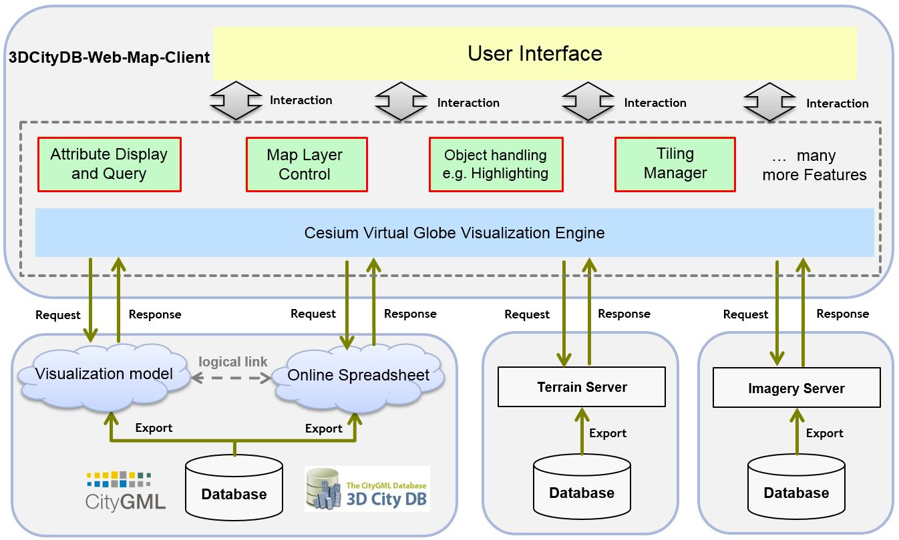

3DCityDB-Web-Map
==================================

News
-------
#### Version 3.0 (POC) — Vue 3 + Vite rewrite

The next-generation 3DCityDB-Web-Map is a ground-up rewrite of the v2 codebase
using **Vue 3**, **TypeScript**, **Vite**, **Pinia** (state) and **Element Plus** (UI),
on top of **CesiumJS 1.141**.

It currently supports the following 3D data formats:
**Cesium 3D Tiles**, **Indexed 3D Scene Layers (I3S)** and **GeoJSON**.

Thematic data sources: **Google Spreadsheets**, **PostgreSQL** (via PostgREST),
**OGC Feature API**, and **embedded** attributes inside the visualization datasets.

> **Note:** v3 is currently a proof-of-concept (`3.0.0-poc`). Legacy formats
> (COLLADA / KML / glTF / CZML) from v2 are not supported in v3. For those, use
> [v2.0.0](https://github.com/3dcitydb/3dcitydb-web-map/releases/tag/v2.0.0).

Introduction
-------
The **3DCityDB-Web-Map** is a web-based application for high-performance 3D visualization
and interactive exploration of **arbitrarily large semantic 3D city models** and other geospatial
data. The client uses the [Cesium Virtual Globe](https://cesium.com/) as its 3D geo-visualization
engine — based on HTML5 and WebGL — providing hardware-accelerated cross-platform rendering in
the browser without plugins.

Key features of the v3 client:

* Add and remove an **arbitrary number of data layers** at runtime: **Cesium 3D Tiles**, **I3S**,
  and **GeoJSON**, together with a configurable **WMS / WMTS** imagery layer and Cesium digital
  terrain model
* **Identifier-driven object lookup**: features are identified by an `OBJECTID` property
  (case-insensitive), falling back to the first property if not present. The default column name
  is configurable per thematic data source via `idColName`.
* Link visualization layers with **external thematic data sources** — **Google Sheets**,
  **PostgreSQL / PostgREST**, or **OGC Feature API** — and query attributes per 3D object
* Display **embedded thematic attributes** that ship inside the visualization datasets
* **Interactive selection**: hover highlight, click select, CTRL+click multi-select,
  hide / show / fly-to-layer
* Explore 3D objects via third-party mapping services — **Google StreetView**, **Bing Maps
  oblique view**, **OpenStreetMap**, and **DualMaps**
* Toggle **scene shadows** and **terrain shadows** (terrain shadows auto-enable the global
  shadow map when turned on)
* **Scene-link sharing**: encode camera, shadows, all loaded layers, imagery / terrain and
  splash settings into a URL that can be bookmarked or shared
* Search box hooked into Cesium's geocoder: typing an object id triggers a thematic-data
  centroid lookup before falling back to the normal geocoder
* **Mobile support** (smartphones, tablets) with device-orientation-aware UI and a GPS button
  for live location / orientation tracking
* **Splash window** with "Don't show again" persistence (per-URL, stored in `localStorage`)

Architecture
-------
<p align="center">

</p>

Tech stack
-------
| Layer | Tool |
|---|---|
| 3D engine | CesiumJS 1.141 |
| Framework | Vue 3 (`<script setup>`) |
| Language | TypeScript |
| Build | Vite 5 + `vite-plugin-cesium` |
| State | Pinia |
| UI components | Element Plus (dark theme) |
| Cesium nav widget | `cesium-navigation-es6` |

Development
-------
```bash
# install deps
npm install

# dev server (http://localhost:5173)
npm run dev

# production build → dist/
npm run build

# preview the production build locally
npm run preview

# type-check only
npm run typecheck
```

Cesium static assets are served externally at runtime (via `vite-plugin-cesium`),
so they are not bundled into the application JS.

License
-------
The 3DCityDB-Web-Map is licensed under the [Apache License, Version 2.0](http://www.apache.org/licenses/LICENSE-2.0). See the `LICENSE` file for more details.

System requirements
-------
The hardware running the 3DCityDB-Web-Map must have a WebGL-capable graphics card,
and the browser must provide appropriate WebGL support. You can check WebGL support at
[https://get.webgl.org/](https://get.webgl.org).

The client has been successfully tested on (but is not limited to):
* Apple Safari
* Mozilla Firefox
* Google Chrome
* Microsoft Edge

For best performance, Google Chrome is recommended.

Mobile support
-------
The client detects mobile devices automatically and adjusts its UI:

* Lightweight UI: noisy credits, hover-only widgets and some Cesium controls are hidden;
  remaining controls grow to comfortable touch sizes.
* Fullscreen scrollable InfoBox on iOS / Android.
* **GPS button** in the toolbar with four modes:
  * **Snapshot** — current location and orientation, one-off.
  * **Compass tracking** — live orientation, fixed position.
  * **First-person view** — live orientation **and** position.
  * **Off** — releases sensor tracking; camera pulls back to a higher altitude.

The Geolocation API requires HTTPS (since Chrome 50). Run the client from an HTTPS
deployment or from `localhost` for sensor features to work.

Demos (legacy v2)
-------
The demos below are hosted on the v2 deployment. v3 demo URLs will follow once v3 is
hosted publicly.

[Demo 1: Visualization of LoD3 CityGML top-level features (Berlin Railway scene)](https://www.3dcitydb.org/3dcitydb-web-map/2.0.0/3dwebclient/index.html?title=Railway_Scene_LoD3_Demo&shadows=false&terrainShadows=0&latitude=52.327365948439194&longitude=13.030088863339616&height=217.81657370715422&heading=25.207012266729155&pitch=-29.116822621630785&roll=0.09098022034414832)

[Demo 2: Berlin LoD2 buildings (>500k textured)](https://www.3dcitydb.org/3dcitydb-web-map/2.0.0/3dwebclient/index.html?title=Berlin_Demo&shadows=false&terrainShadows=0&latitude=52.517479728958044&longitude=13.411141287558147&height=534.3099172977386)

[Demo 3: New York City buildings, streets and lots](https://www.3dcitydb.org/3dcitydb-web-map/2.0.0/3dwebclient/index.html?title=NYC_Demo&latitude=40.74337478856652&longitude=-73.98774263868867&height=329.6833486632038)

[Demo 4: Vorarlberg LoD2 buildings + 0.5m DTM](https://www.3dcitydb.org/3dcitydb-web-map/2.0.0/3dwebclient/index.html?title=Vorarlberg_Demo&shadows=false&terrainShadows=0&latitude=47.281098391110525&longitude=9.647423262947104&height=692.0842786450354)

Contributing
-------
The source code is hosted on [GitHub](https://github.com/3dcitydb/3dcitydb-web-map).
Releases are tracked under [releases](https://github.com/3dcitydb/3dcitydb-web-map/releases).

* Report bugs by opening a GitHub issue.
* Contribute fixes by opening a pull request that references the issue id.
* For larger feature proposals, open a GitHub issue first to discuss.

Developers
-------
**v3 (current) — Vue 3 / Vite / TypeScript rewrite:**

* Zhihang Yao
<br>[Hochschule für Technik Stuttgart (HFT Stuttgart)](https://www.hft-stuttgart.de/)

**v2 and earlier — original 3DCityDB-Web-Map-Client (legacy name):**

* Son H. Nguyen, Kanishk Chaturvedi, and Thomas H. Kolbe
<br>[Chair of Geoinformatics, Technical University of Munich](https://www.asg.ed.tum.de/en/gis)

with the support of:

* Zhihang Yao, Jannes Bolling, Lucas van Walstijn, and Claus Nagel
<br>[Virtual City Systems, Berlin](https://vc.systems)

More information
-------
The 3DCityDB-Web-Map is part of the [3DCityDB Software Suite](https://www.3dcitydb.org)
for managing large semantic 3D city models in CityGML. It can also be used as a standalone
component.

[OGC CityGML](https://www.opengeospatial.org/standards/citygml) is an open data model and
XML-based format for storage and exchange of semantic 3D city models — an application schema
for [GML3](https://www.opengeospatial.org/standards/gml), the international spatial-data
exchange standard issued by OGC and ISO TC211.

Acknowledgement
-------
The development was supported and partially funded by [CADFEM](https://www.cadfem.net) within
a dedicated collaboration project in the context of the
[Leonhard Obermeyer Center (LOC)](https://www.ed.tum.de/loc) at the
[Technical University of Munich (TUM)](https://www.tum.de).
