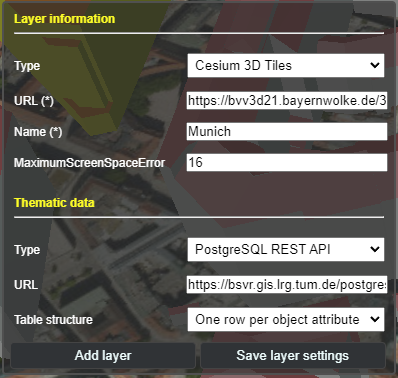

[Release v2.0.0 demo link](https://www.3dcitydb.org/3dcitydb-web-map/2.0.0/3dwebclient/index.html)

This is a major release.

### New Features

* It is now possible to add **Index 3D Scene (i3s)** and **GeoJSON** layers, in addition to the existing layer types **KML/COLLADA/glTF** and **Cesium 3D Tiles**.

* Existing **thematic data embedded** within the 3D layers themselves can now also be extracted and displayed, in addition to the already available options to include external thematic data using **PostgreSQL/PostgREST** and **Google Spreadsheets**. These layers include Index 3D Scene (i3s), KML, Cesium 3D Tiles, and GeoJSON.

  **Note**: Due to the inconsistent **labelling of object identifiers** in Cesium 3D Tiles from various providers, the following approach was used for querying:
  * Different identifier names are considered, such as `gml:id`, `gml_id`, `gmlid`, `gml-id`, `id`, etc., regardless of whether the letters are given in uppercase or lowercase.
  * The same also applies to the column name of the identifiers in PostgreSQL/PostgREST and Google Spreadsheets, as long as the column names are valid.

* In addition to embedded data and external PostgreSQL/PostgREST and Google Spreadsheets, **OGC Feature API** is now also supported as another external thematic data source.

  **Note**: Due to the different implementation of the API across regions and countries, the current version provides some examples for handling the OGC Feature API implementations provided by the German states of Hamburg and North Rhine-Westphalia.

* **Web Map Tile Service (WMTS)** can now be used as another imagery or base map layer, in addition to the existing **Web Map Service (WMS)**.

### Improvements

* The **Graphical User Interface (GUI)** for adding and configuring layers in the toolbox have been rearranged to provide more clarity and consistency. The input elements are now grouped into two groups based on their functions for the selected layer type: **layer information** and **thematic data**, as shown in the example below:

  

    
  

* **Mobile support for geolocation** has been completely reworked to adhere to modern security rules on personal devices, especially for **iOS 13+**. The new button icons and their functions are explained as follows:

  

    
    
    
    
    
  

  **From left to right**: Default button, "snapshot" of location and orientation, live tracking of orientation (with fixed location), live tracking of orientation and location, and button for disabling geolocation.

* The **highlighting and hiding functions** have been reworked, so that objects from across different layer types can be displayed correctly and consistently together.

* **Cesium 3D Tiles** can now be navigated together with **Google Street View**, **Dual Map View**, etc.

### Change Logs

For a complete list of all changes made for this release, please refer to the [change logs](CHANGES.md).
